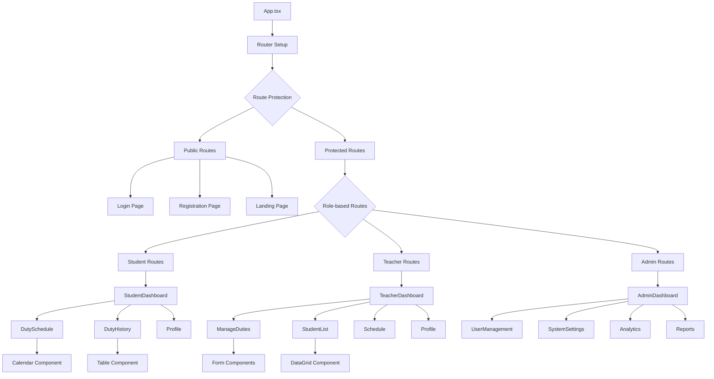
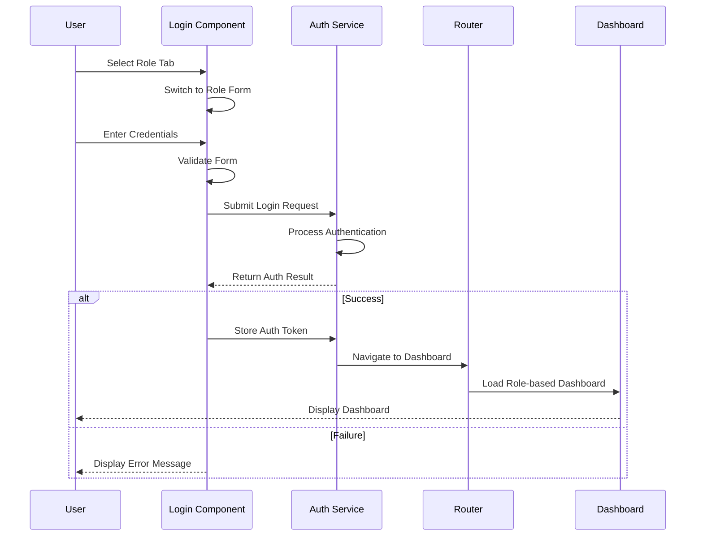
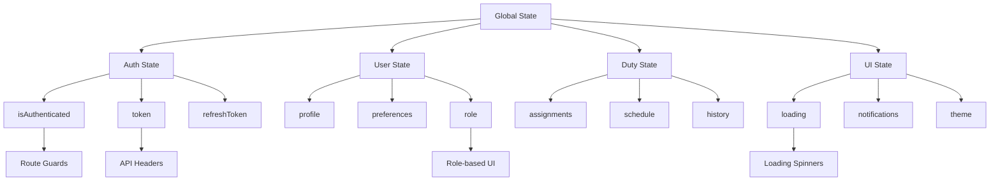
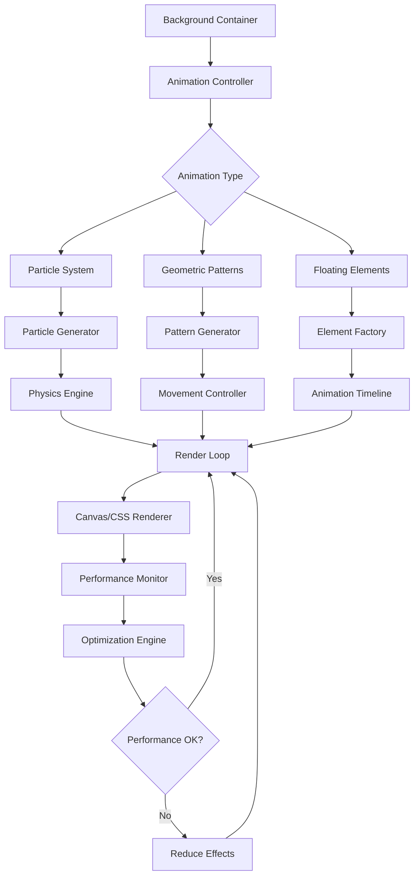
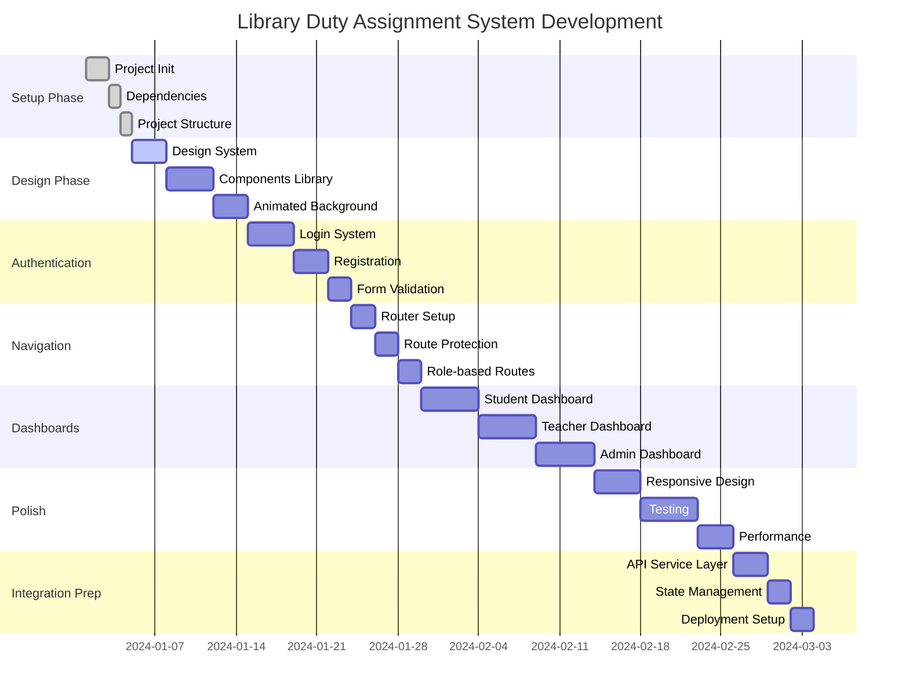

# Library Duty Assignment System - Development Flowchart

## Frontend Development Flow

```mermaid
flowchart TD
    A[Start Project] --> B[Initialize React + TypeScript]
    B --> C[Setup Project Structure]
    C --> D[Configure Dependencies]
    
    D --> E[Create Design System]
    E --> F[Build Reusable Components]
    F --> G[Implement Animated Background]
    
    G --> H{Authentication System}
    H --> I[Login Page Layout]
    H --> J[Role Selection Tabs]
    H --> K[Form Components]
    
    I --> L[Student Login Form]
    J --> M[Teacher Login Form]
    K --> N[Admin Login Form]
    
    L --> O[Form Validation]
    M --> O
    N --> O
    
    O --> P[Registration System]
    P --> Q[Student Registration]
    P --> R[Teacher Registration]
    P --> S[Admin Registration]
    
    Q --> T[Route Setup]
    R --> T
    S --> T
    
    T --> U[React Router Config]
    U --> V[Route Protection]
    V --> W[Role-based Routing]
    
    W --> X{Dashboard Development}
    X --> Y[Student Dashboard]
    X --> Z[Teacher Dashboard]
    X --> AA[Admin Dashboard]
    
    Y --> BB[Duty View Components]
    Z --> CC[Duty Management]
    AA --> DD[User Management]
    
    BB --> EE[Calendar Integration]
    CC --> EE
    DD --> EE
    
    EE --> FF[Data Display Components]
    FF --> GG[Interactive Forms]
    GG --> HH[Responsive Design]
    
    HH --> II[Mobile Optimization]
    II --> JJ[Accessibility Features]
    JJ --> KK[Performance Optimization]
    
    KK --> LL[Code Splitting]
    LL --> MM[Bundle Optimization]
    MM --> NN[Testing Implementation]
    
    NN --> OO[Unit Tests]
    NN --> PP[Integration Tests]
    NN --> QQ[E2E Tests]
    
    OO --> RR[API Service Layer]
    PP --> RR
    QQ --> RR
    
    RR --> SS[State Management Setup]
    SS --> TT[Authentication State]
    TT --> UU[User Profile State]
    UU --> VV[Duty Assignment State]
    
    VV --> WW[Production Build]
    WW --> XX[Deployment Setup]
    XX --> YY[Ready for Backend Integration]
```

## Component Architecture Flow

## Authentication Flow

## State Management Flow

## Background Animation System

## Development Phases Timeline

